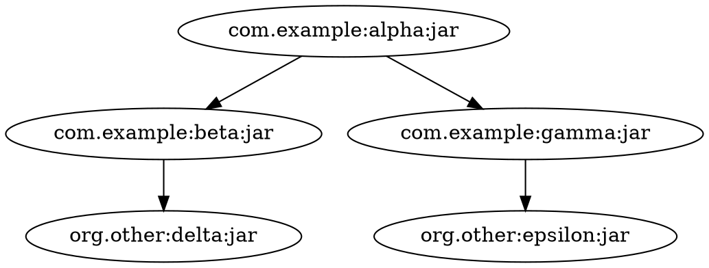

# dot-viz Modernization Implementation Plan

> **For agentic workers:** REQUIRED SUB-SKILL: Use superpowers:subagent-driven-development (recommended) or superpowers:executing-plans to implement this plan task-by-task. Steps use checkbox (`- [ ]`) syntax for tracking.

**Goal:** Modernize dot-viz in three phases — correctness fixes (A), structural refactors (B), and Vite build migration (C) — each verified with Playwright end-to-end tests.

**Architecture:** The app is a React frontend (bundled to `client/dist/`) served by a thin Express server. All React state lives in `SettingsContext`; the Cytoscape instance currently leaks onto `window.cy`. Phase A fixes bugs without changing structure. Phase B extracts large files into focused modules. Phase C replaces Webpack+Babel with Vite.

**Tech Stack:** React 18, Cytoscape.js, react-cytoscapejs, Express, @playwright/test, @dagrejs/graphlib-dot, use-debounce, Vite (Phase C)

---

## File Map

**Phase A — files modified:**
- `package.json` — add React 18, use-debounce, @playwright/test
- `client/src/index.jsx` — createRoot
- `client/src/hooks/useCy.js` — CytoscapeContext + CytoscapeProvider
- `client/src/components/Graph.jsx` — use context, memoize elements, fix event cleanup
- `client/src/utils/nodes.js` — file.text(), remove FileReader boilerplate
- `client/src/components/controls/ExportControl.jsx` — try/finally
- `client/src/components/controls/FilterControl.jsx` — use-debounce
- `test/fixtures/sample.dot` — test fixture (new)
- `test/e2e/app.spec.js` — Playwright golden-path tests (new)
- `playwright.config.js` — Playwright config (new)

**Phase B — files modified/created:**
- `client/src/layouts/index.js` — re-exports all layouts + registers Cytoscape plugins (new)
- `client/src/layouts/avsdf.js` — avsdf config (new)
- `client/src/layouts/breadthfirst.js` — breadthfirst config (new)
- `client/src/layouts/circle.js` — circle config (new)
- `client/src/layouts/cola.js` — cola config (new)
- `client/src/layouts/concentric.js` — concentric config (new)
- `client/src/layouts/cise.js` — cise config (new)
- `client/src/layouts/cose.js` — cose config (new)
- `client/src/layouts/euler.js` — euler config (new)
- `client/src/layouts/fcose.js` — fcose config (new)
- `client/src/layouts/grid.js` — grid config (new)
- `client/src/layouts/klay.js` — klay config (new)
- `client/src/layouts/random.js` — random config (new)
- `client/src/components/controls/LayoutControl.jsx` — component logic only (~200 lines)
- `client/src/utils/nodes.js` — rewrite using @dagrejs/graphlib-dot
- `client/src/hooks/useFilterNodes.js` — node visibility hook (new)
- `client/src/hooks/useFilterEdges.js` — edge visibility hook (new)
- `client/src/hooks/useFilterConnected.js` — connected-node A* hook (new)
- `client/src/components/controls/FilterControl.jsx` — use the three hooks

**Phase C — files modified/deleted/created:**
- `package.json` — add vite, @vitejs/plugin-react; remove webpack/babel deps; upgrade nodemon/cytoscape/react-icons; remove unused packages
- `vite.config.js` — new Vite config (new)
- `client/index.html` — move from `client/dist/index.html`, update script tag (new location)
- `webpack.config.cjs` — delete
- `babel.config.json` — delete

---

## Phase A — Correctness & Reliability Fixes

### Task A1: Install Phase A dependencies

**Files:**
- Modify: `package.json`

- [ ] **Step 1: Install React 18, use-debounce, and Playwright**

```bash
npm install react@18.3.1 react-dom@18.3.1
npm install use-debounce
npm install --save-dev @playwright/test
```

- [ ] **Step 2: Install Playwright browsers**

```bash
npx playwright install chromium
```

Expected: Downloads Chromium browser binary. Output ends with "chromium ... (playwright build ...)".

- [ ] **Step 3: Verify package.json has the right versions**

```bash
node -e "const p=require('./package.json'); console.log('react:', p.dependencies.react, 'react-dom:', p.dependencies['react-dom'], 'use-debounce:', p.dependencies['use-debounce'])"
```

Expected output (versions may differ slightly):
```
react: 18.3.1  react-dom: 18.3.1  use-debounce: 10.1.1
```

- [ ] **Step 4: Commit**

```bash
git add package.json package-lock.json
git commit -m "chore: upgrade to React 18, add use-debounce and Playwright"
```

---

### Task A2: Write the Playwright test suite and fixture

This establishes the green baseline before any code changes.

**Files:**
- Create: `test/fixtures/sample.dot`
- Create: `test/e2e/app.spec.js`
- Create: `playwright.config.js`

- [ ] **Step 1: Create the sample .dot fixture**

```bash
mkdir -p test/fixtures
```

Create `test/fixtures/sample.dot` with this content:



- [ ] **Step 2: Create playwright.config.js**

```js
import { defineConfig } from '@playwright/test';

export default defineConfig({
    testDir: './test/e2e',
    timeout: 30000,
    use: {
        baseURL: 'http://localhost:8080',
        headless: true,
    },
    webServer: {
        command: 'npm start',
        url: 'http://localhost:8080',
        reuseExistingServer: !process.env.CI,
        timeout: 15000,
    },
});
```

- [ ] **Step 3: Create test/e2e/app.spec.js**

```bash
mkdir -p test/e2e
```

```js
import { test, expect } from '@playwright/test';
import path from 'path';
import { fileURLToPath } from 'url';

const __dirname = path.dirname(fileURLToPath(import.meta.url));
const FIXTURE = path.resolve(__dirname, '../fixtures/sample.dot');

test('app loads without errors', async ({ page }) => {
    const errors = [];
    page.on('pageerror', e => errors.push(e.message));
    await page.goto('/');
    await expect(page.locator('#root')).toBeVisible();
    expect(errors).toHaveLength(0);
});

test('upload dot file renders graph nodes', async ({ page }) => {
    await page.goto('/');
    const fileInput = page.locator('input[type="file"]');
    await fileInput.setInputFiles(FIXTURE);
    // Wait for graph canvas to have elements - cy renders into a canvas inside the container
    await page.waitForFunction(() => window.cy && window.cy.nodes().length > 0, { timeout: 10000 });
    const nodeCount = await page.evaluate(() => window.cy.nodes().length);
    expect(nodeCount).toBe(5);
});

test('source toggle switches between artifacts and groups', async ({ page }) => {
    await page.goto('/');
    const fileInput = page.locator('input[type="file"]');
    await fileInput.setInputFiles(FIXTURE);
    await page.waitForFunction(() => window.cy && window.cy.nodes().length > 0, { timeout: 10000 });

    // Switch to Groups view
    await page.getByText('Groups').click();
    await page.waitForFunction(() => window.cy.nodes().length < 5, { timeout: 5000 });
    const groupCount = await page.evaluate(() => window.cy.nodes().length);
    expect(groupCount).toBe(2); // com.example and org.other

    // Switch back to Artifacts
    await page.getByText('Artifacts').click();
    await page.waitForFunction(() => window.cy.nodes().length === 5, { timeout: 5000 });
});

test('filter input hides non-matching nodes', async ({ page }) => {
    await page.goto('/');
    await page.locator('input[type="file"]').setInputFiles(FIXTURE);
    await page.waitForFunction(() => window.cy && window.cy.nodes().length > 0, { timeout: 10000 });

    await page.locator('input[name="filter"]').fill('alpha');
    await page.waitForTimeout(400); // debounce

    const visibleCount = await page.evaluate(() => window.cy.nodes(':visible').length);
    expect(visibleCount).toBe(1);
});

test('edge filter toggle hides test edges', async ({ page }) => {
    await page.goto('/');
    await page.locator('input[type="file"]').setInputFiles(FIXTURE);
    await page.waitForFunction(() => window.cy && window.cy.nodes().length > 0, { timeout: 10000 });

    const testEdgesBefore = await page.evaluate(() =>
        window.cy.edges('[linkType = "test"]:visible').length
    );
    expect(testEdgesBefore).toBeGreaterThan(0);

    // Toggle off Test edges
    await page.getByText('Test').click();
    await page.waitForTimeout(200);

    const testEdgesAfter = await page.evaluate(() =>
        window.cy.edges('[linkType = "test"]:visible').length
    );
    expect(testEdgesAfter).toBe(0);
});

test('layout change re-renders graph', async ({ page }) => {
    await page.goto('/');
    await page.locator('input[type="file"]').setInputFiles(FIXTURE);
    await page.waitForFunction(() => window.cy && window.cy.nodes().length > 0, { timeout: 10000 });

    // Open layout picker and select circle
    await page.locator('button[title="Select layout"]').click();
    await page.getByText('circle').click();
    await page.waitForTimeout(1000); // layout animates

    const nodeCount = await page.evaluate(() => window.cy.nodes(':visible').length);
    expect(nodeCount).toBeGreaterThan(0);
});

test('export button triggers download', async ({ page }) => {
    await page.goto('/');
    await page.locator('input[type="file"]').setInputFiles(FIXTURE);
    await page.waitForFunction(() => window.cy && window.cy.nodes().length > 0, { timeout: 10000 });

    const [download] = await Promise.all([
        page.waitForEvent('download'),
        page.getByText('Export PNG').click(),
    ]);
    expect(download.suggestedFilename()).toBe('graph.png');
});

test('zoom in and fit buttons work', async ({ page }) => {
    await page.goto('/');
    await page.locator('input[type="file"]').setInputFiles(FIXTURE);
    await page.waitForFunction(() => window.cy && window.cy.nodes().length > 0, { timeout: 10000 });

    const zoomBefore = await page.evaluate(() => window.cy.zoom());
    await page.locator('button[title="Zoom In"]').click();
    await page.waitForTimeout(300);
    const zoomAfter = await page.evaluate(() => window.cy.zoom());
    expect(zoomAfter).toBeGreaterThan(zoomBefore);

    await page.locator('button[title="See whole graph"]').click();
    await page.waitForTimeout(300);
    // just verify it doesn't crash
    const nodeCount = await page.evaluate(() => window.cy.nodes(':visible').length);
    expect(nodeCount).toBe(5);
});
```

- [ ] **Step 4: Add test script to package.json**

Edit `package.json` scripts section to add:
```json
"test:e2e": "playwright test"
```

Full scripts section:
```json
"scripts": {
    "test": "echo \"Error: no test specified\" && exit 1",
    "test:e2e": "playwright test",
    "start": "nodemon --ignore 'store/*' --ignore 'client/*' src/index.js",
    "react-dev": "webpack --watch",
    "build": "webpack"
},
```

- [ ] **Step 5: Build the app and run tests to confirm baseline**

```bash
npm run build
npx playwright test
```

Expected: All tests pass (the existing app already has `window.cy` which the tests rely on). If any fail, debug before proceeding — these tests define the contract for all future phases.

- [ ] **Step 6: Commit**

```bash
git add test/ playwright.config.js package.json package-lock.json
git commit -m "test: add Playwright e2e suite with sample .dot fixture"
```

---

### Task A3: Fix `index.jsx` — React 18 createRoot

**Files:**
- Modify: `client/src/index.jsx`

- [ ] **Step 1: Update index.jsx**

Replace the entire file:

```jsx
import React from 'react';
import { createRoot } from 'react-dom/client';
import App from './components/App.jsx';

createRoot(document.getElementById('root')).render(<App />);
```

- [ ] **Step 2: Build and verify**

```bash
npm run build 2>&1 | tail -5
```

Expected: Build succeeds with no errors.

- [ ] **Step 3: Run tests**

```bash
npx playwright test
```

Expected: All tests pass.

- [ ] **Step 4: Commit**

```bash
git add client/src/index.jsx
git commit -m "fix: upgrade to React 18 createRoot"
```

---

### Task A4: Replace `window.cy` global with React Context

**Files:**
- Modify: `client/src/hooks/useCy.js`
- Modify: `client/src/components/Graph.jsx`
- Modify: `client/src/components/App.jsx`

- [ ] **Step 1: Rewrite useCy.js**

Replace the entire file:

```js
import { createContext, useContext, useState } from 'react';

const CytoscapeContext = createContext(null);

export const CytoscapeProvider = CytoscapeContext.Provider;

export function useCy() {
    return useContext(CytoscapeContext);
}

export function useCyState() {
    return useState(null);
}
```

- [ ] **Step 2: Update Graph.jsx to set context instead of window.cy**

In `Graph.jsx`, add the import and change how the cy instance is captured. The `CytoscapeComponent` receives a `cy` callback prop — use that to call a setter passed down from App.

Replace the entire `Graph.jsx`:

```jsx
import React, { useState, useEffect, useMemo } from 'react';
import CytoscapeComponent from 'react-cytoscapejs';
import { useSetSelection, useSettingsContext, useBumpLayoutTrigger } from '../hooks/useSettings.js';
import { useCy } from '../hooks/useCy';
import './graph.css';

const Graph = ({ onCyInit }) => {
    const [elements, setElements] = useState([]);
    const { settings } = useSettingsContext();
    const { setSelection } = useSetSelection();
    const { bumpLayoutTrigger } = useBumpLayoutTrigger();
    const cy = useCy();

    // Build a node lookup map for O(1) target resolution
    const nodeMap = useMemo(() => {
        const nodeData = settings.nodeData[settings.source];
        return new Map(nodeData.map(n => [n.id, n]));
    }, [settings.source, settings.nodeData]);

    // Convert nodeData to Cytoscape elements
    const computedElements = useMemo(() => {
        const nodeData = settings.nodeData[settings.source];
        const els = [];

        nodeData.forEach((n) => {
            els.push({
                data: {
                    id: n.id,
                    label: n.name,
                    color: n.color,
                    root: !n.isRoot,
                    group: n.group,
                    depth: n.depth,
                    nodeWidth: Math.max(n.name.length * 7 + 16, 40),
                    nodeHeight: 28,
                },
                classes: n.isRoot ? 'root-node' : '',
            });
        });

        nodeData.forEach((n) => {
            n.links.forEach((l) => {
                const targetNode = nodeMap.get(l.target);
                if (!targetNode) {
                    console.error('Link target not found', l);
                    return;
                }

                const col = l.linkType === 'grouping'
                    ? { source: '#FFFFFF', target: '#FFFFFF' }
                    : { source: n.color, target: targetNode.color };

                els.push({
                    data: {
                        id: `${l.linkType}-${l.source}-${l.target}`,
                        source: l.source,
                        target: l.target,
                        label: l.label,
                        sourceColor: col.source,
                        targetColor: col.target,
                        gradient: `${col.source} ${col.target}`,
                        linkType: l.linkType,
                        isHard: l.isHard,
                    },
                });
            });
        });

        return els;
    }, [settings.source, settings.nodeData, nodeMap]);

    useEffect(() => {
        setElements(computedElements);
        bumpLayoutTrigger();
    }, [computedElements]);

    const cytoscapeStylesheet = [
        {
            selector: 'node',
            style: {
                'background-color': 'data(color)',
                width: 'data(nodeWidth)',
                height: 'data(nodeHeight)',
                shape: 'round-rectangle',
                'min-zoomed-font-size': 8,
            },
        },
        {
            selector: 'node.root-node',
            style: {
                shape: 'hexagon',
            },
        },
        {
            selector: ':selected',
            css: {
                'underlay-color': '#00ffff',
                'underlay-padding': '5px',
                'underlay-opacity': '0.5',
            },
        },
        {
            selector: 'node[label]',
            style: {
                label: 'data(label)',
                'font-size': '12',
                color: 'white',
                'text-halign': 'center',
                'text-valign': 'center',
            },
        },
        {
            selector: 'edge',
            style: {
                'curve-style': 'bezier',
                'target-arrow-shape': 'triangle',
                'target-arrow-color': 'data(targetColor)',
                'line-fill': 'linear-gradient',
                'line-gradient-stop-colors': 'data(gradient)',
                'line-gradient-stop-positions': '50',
                width: 1.5,
            },
        },
        {
            selector: 'edge[label]',
            style: {
                label: 'data(label)',
                'font-size': '12',
                'text-background-color': 'white',
                'text-background-opacity': 1,
                'text-background-padding': '2px',
                'text-border-color': 'black',
                'text-border-style': 'solid',
                'text-border-width': 0.5,
                'text-border-opacity': 1,
                'text-rotation': 'autorotate',
            },
        },
        {
            selector: ':parent',
            style: {
                'background-opacity': 0.333,
                'border-color': '#2B65EC',
            },
        },
    ];

    useEffect(() => {
        if (!cy) return;
        const handleSelect = () => setSelection(cy.nodes().filter(':selected'));
        cy.on('select unselect boxselect', handleSelect);
        return () => cy.off('select unselect boxselect', handleSelect);
    }, [cy, setSelection]);

    return (
        <div style={{ top: 0, bottom: 0, left: 0, right: 0, position: 'absolute' }}>
            <CytoscapeComponent
                cy={(instance) => {
                    // Keep window.cy for Playwright tests (removed in Phase B)
                    window.cy = instance;
                    onCyInit(instance);
                }}
                elements={elements}
                style={{ top: 0, bottom: 0, left: 0, right: 0, position: 'absolute', width: '100%' }}
                stylesheet={cytoscapeStylesheet}
            />
            {settings.loading && (
                <div className="graph-loading-overlay">
                    <div className="graph-loading-spinner" />
                </div>
            )}
        </div>
    );
};

export default Graph;
```

- [ ] **Step 3: Update App.jsx to own the CytoscapeContext**

Replace the entire `App.jsx`:

```jsx
import React, { useState, useMemo, useCallback } from 'react';
import { SettingsProvider } from '../hooks/useSettings.js';
import { CytoscapeProvider, useCyState } from '../hooks/useCy.js';
import ControlsContainer from './controls/ControlsContainer.jsx';
import ExportControl from './controls/ExportControl.jsx';
import DotControl from './controls/DotControl.jsx';
import FilterControl from './controls/FilterControl.jsx';
import LayoutControl from './controls/LayoutControl.jsx';
import SourceControl from './controls/SourceControl.jsx';
import ZoomControl from './controls/ZoomControl.jsx';
import Graph from './Graph.jsx';

const App = () => {
    const [settings, setSettings] = useState({
        contentModifiedTS: 0,
        fed: null,
        source: 'artifacts',
        selection: [],
        layoutTrigger: 0,
        loading: false,
        nodeData: {
            groups: [],
            artifacts: [],
        },
        nodeFilter: {
            filter: '',
            connected: false,
            direction: 'both',
        },
        edgeFilter: {
            compile: true,
            provided: true,
            test: false,
            grouping: true,
        },
    });
    const [cy, setCy] = useCyState();

    const settingsContext = useMemo(() => ({ settings, setSettings }), [settings]);
    const handleCyInit = useCallback((instance) => setCy(instance), [setCy]);

    return (
        <SettingsProvider value={settingsContext}>
            <CytoscapeProvider value={cy}>
                <Graph onCyInit={handleCyInit} />
                <ControlsContainer position={'top-left'}>
                    <DotControl />
                    <SourceControl />
                    <FilterControl />
                    <ExportControl />
                </ControlsContainer>
                <ControlsContainer position={'bottom-right'}>
                    <ZoomControl />
                    <LayoutControl layoutTrigger={settings.layoutTrigger} />
                </ControlsContainer>
            </CytoscapeProvider>
        </SettingsProvider>
    );
};

export default App;
```

- [ ] **Step 4: Build and run tests**

```bash
npm run build 2>&1 | tail -5
npx playwright test
```

Expected: All tests pass. The `window.cy` assignment in Graph.jsx keeps Playwright tests working during the transition.

- [ ] **Step 5: Commit**

```bash
git add client/src/hooks/useCy.js client/src/components/Graph.jsx client/src/components/App.jsx
git commit -m "fix: replace window.cy global with React Context"
```

---

### Task A5: Fix nodes.js — file.text() and var cleanup

**Files:**
- Modify: `client/src/utils/nodes.js`

- [ ] **Step 1: Replace the FileReader boilerplate**

In `nodes.js`, replace the `readDot` function and `nodify` wrapper. The rest of the file (`parseNode`, `parseEdge`, `parseDot`, etc.) stays unchanged.

Replace these lines at the top and bottom of the file:

Remove the old `readDot` (lines ~8-22):
```js
const readDot = (dotfile) => {
    return new Promise((resolve, reject) => {
        var fr = new FileReader();  
        fr.onload = () => {
            try {
                resolve(parseDot(fr.result));
            } catch (err) {
                reject(err);
            }
        };
        fr.onerror = reject;
        fr.readAsText(dotfile);
      });
}
```

Replace with:
```js
const readDot = (file) => file.text().then(parseDot);
```

Remove the old `nodify` wrapper at the bottom:
```js
const nodify = async (dotfile) => {
    const dotData = await readDot(dotfile);
    return dotData;
};

export default nodify;
```

Replace with:
```js
export default readDot;
```

- [ ] **Step 2: Build and run tests**

```bash
npm run build 2>&1 | tail -5
npx playwright test
```

Expected: All tests pass.

- [ ] **Step 3: Commit**

```bash
git add client/src/utils/nodes.js
git commit -m "fix: replace FileReader with file.text() in DOT parser"
```

---

### Task A6: Fix ExportControl — try/finally for busy state

**Files:**
- Modify: `client/src/components/controls/ExportControl.jsx`

- [ ] **Step 1: Add try/finally to exportCy**

Replace the `exportCy` callback in `ExportControl.jsx`:

```jsx
const exportCy = useCallback(async () => {
    setBusy(true);
    try {
        const img = await cy.png({ full: true, scale: 1, output: 'blob-promise' });
        saveAs(img, 'graph.png');
    } catch (err) {
        console.error('Export failed:', err);
    } finally {
        setBusy(false);
    }
}, [cy]);
```

- [ ] **Step 2: Build and run tests**

```bash
npm run build 2>&1 | tail -5
npx playwright test
```

Expected: All tests pass, including the export download test.

- [ ] **Step 3: Commit**

```bash
git add client/src/components/controls/ExportControl.jsx
git commit -m "fix: add try/finally to export so busy state always clears"
```

---

### Task A7: Fix FilterControl — use-debounce and cleanup

**Files:**
- Modify: `client/src/components/controls/FilterControl.jsx`

- [ ] **Step 1: Replace manual debounce with useDebouncedCallback**

At the top of `FilterControl.jsx`, add the import:
```js
import { useDebouncedCallback } from 'use-debounce';
```

Remove these lines:
```js
const debounceTimer = useRef(null);

const debouncedSetNodeFilter = useCallback((value) => {
    clearTimeout(debounceTimer.current);
    debounceTimer.current = setTimeout(() => {
        setNodeFilter({
            filter: value,
            connected: false,
            direction: settings.nodeFilter.direction,
        });
    }, 200);
}, [setNodeFilter, settings.nodeFilter.direction]);
```

Replace with:
```js
const debouncedSetNodeFilter = useDebouncedCallback((value) => {
    setNodeFilter({
        filter: value,
        connected: false,
        direction: settings.nodeFilter.direction,
    });
}, 200);
```

Also remove the `useRef` import if it's now unused (check if anything else in the file uses `useRef`).

- [ ] **Step 2: Build and run tests**

```bash
npm run build 2>&1 | tail -5
npx playwright test
```

Expected: All tests pass.

- [ ] **Step 3: Commit**

```bash
git add client/src/components/controls/FilterControl.jsx
git commit -m "fix: replace manual debounce with useDebouncedCallback"
```

---

### Task A8: Phase A verification

- [ ] **Step 1: Run full test suite**

```bash
npx playwright test --reporter=list
```

Expected: All 7 tests pass with no failures.

- [ ] **Step 2: Verify no console errors in headed mode**

```bash
npx playwright test --headed test/e2e/app.spec.js
```

Visually verify the graph renders, filter works, and layout changes animate.

---

## Phase B — Structural Refactors

### Task B1: Extract LayoutControl configs into layout files

**Files:**
- Create: `client/src/layouts/index.js`
- Create: `client/src/layouts/avsdf.js`
- Create: `client/src/layouts/breadthfirst.js`
- Create: `client/src/layouts/circle.js`
- Create: `client/src/layouts/cola.js`
- Create: `client/src/layouts/concentric.js`
- Create: `client/src/layouts/cise.js`
- Create: `client/src/layouts/cose.js`
- Create: `client/src/layouts/euler.js`
- Create: `client/src/layouts/fcose.js`
- Create: `client/src/layouts/grid.js`
- Create: `client/src/layouts/klay.js`
- Create: `client/src/layouts/random.js`
- Modify: `client/src/components/controls/LayoutControl.jsx`

- [ ] **Step 1: Create client/src/layouts/ directory**

```bash
mkdir -p client/src/layouts
```

- [ ] **Step 2: Extract each layout config from LayoutControl.jsx into its own file**

Open `LayoutControl.jsx` and cut the body of `supportedLayouts.avsdf` (everything inside `avsdf: { ... },`). Create `client/src/layouts/avsdf.js`:

```js
const avsdf = {
    name: 'avsdf',
    refresh: 30,
    fit: true,
    padding: 10,
    ungrabifyWhileSimulating: false,
    animate: 'end',
    animationDuration: 500,
    nodeSeparation: 60,
    schema: {
        title: 'avsdf',
        type: 'object',
        properties: {
            animate: {
                type: 'string',
                title: 'Animate',
                default: 'end',
                enum: ['during', 'end'],
                description: 'Type of layout animation',
            },
            animationDuration: {
                type: 'number',
                title: 'Animation Duration',
                default: 500,
                description: 'Duration for animate:end',
            },
            fit: {
                type: 'boolean',
                title: 'Fit',
                default: true,
                description: 'Whether to fit the network view after when done',
            },
            nodeSeparation: {
                type: 'number',
                title: 'Node Separation',
                default: 60,
            },
            padding: {
                type: 'number',
                title: 'Padding',
                default: 10,
                description: 'Padding on fit',
            },
            refresh: {
                type: 'number',
                title: 'Refresh',
                description: 'Number of ticks per frame; higher is faster but more jerky',
                default: 10,
            },
            ungrabifyWhileSimulating: {
                type: 'boolean',
                title: 'Ungrabify While Simulating',
                default: false,
            },
        },
    },
};

export default avsdf;
```

Repeat this pattern for each remaining layout: `breadthfirst`, `circle`, `cola`, `concentric`, `cise`, `cose`, `euler`, `fcose`, `grid`, `klay`, `random`. Copy each layout's object body exactly from `LayoutControl.jsx` into its own file, exporting it as default.

For `random.js` (simplest):
```js
const random = { name: 'random' };
export default random;
```

For `grid.js`:
```js
const grid = { name: 'grid' };
export default grid;
```

For all others, copy the full object verbatim from `LayoutControl.jsx` (lines 108–1753).

- [ ] **Step 3: Create client/src/layouts/index.js**

```js
import Cytoscape from 'cytoscape';
import COSEBilkent from 'cytoscape-cose-bilkent';
import avsdfPlugin from 'cytoscape-avsdf';
import fcosePlugin from 'cytoscape-fcose';
import cola from 'cytoscape-cola';
import cise from 'cytoscape-cise';
import klay from 'cytoscape-klay';
import euler from 'cytoscape-euler';

Cytoscape.use(euler);
Cytoscape.use(klay);
Cytoscape.use(cise);
Cytoscape.use(cola);
Cytoscape.use(fcosePlugin);
Cytoscape.use(avsdfPlugin);
Cytoscape.use(COSEBilkent);

import avsdf from './avsdf.js';
import breadthfirst from './breadthfirst.js';
import circle from './circle.js';
import cola_ from './cola.js';
import concentric from './concentric.js';
import cise_ from './cise.js';
import cose from './cose.js';
import euler_ from './euler.js';
import fcose from './fcose.js';
import grid from './grid.js';
import klay_ from './klay.js';
import random from './random.js';

const layouts = {
    avsdf,
    breadthfirst,
    circle,
    cola: cola_,
    concentric,
    cise: cise_,
    cose,
    euler: euler_,
    fcose,
    grid,
    klay: klay_,
    random,
};

export default layouts;
```

- [ ] **Step 4: Rewrite LayoutControl.jsx to use layouts/index.js**

Replace the entire `LayoutControl.jsx` with:

```jsx
import React, {
    useCallback,
    useEffect,
    useState,
    useMemo,
    useRef,
} from 'react';
import { FiGrid, FiPlay, FiPause, FiSettings } from 'react-icons/fi';
import Form from '@rjsf/core';
import { useCy } from '../../hooks/useCy';
import supportedLayouts from '../../layouts/index.js';
import Button from '../utils/Button.jsx';

const LayoutControl = ({ className, style, children, layoutTrigger }) => {
    const cy = useCy();
    const [opened, setOpened] = useState(false);
    const [layoutConfigOpened, setLayoutConfigOpened] = useState(false);
    const [layoutOverrides, setLayoutOverrides] = useState({});
    const [layout, setLayout] = useState('breadthfirst');
    const [activeLayout, setActiveLayout] = useState();
    const isMounted = useRef(false);

    const htmlProps = {
        style,
        className: `react-cy-control ${className || ''}`,
    };

    const layouts = useMemo(() =>
        Object.fromEntries(
            Object.entries(supportedLayouts).map(([k, v]) => [
                k,
                layoutOverrides[k] ? { ...v, ...layoutOverrides[k] } : v,
            ])
        ),
    [layoutOverrides]);

    const runLayout = useCallback(() => {
        if (activeLayout) {
            activeLayout.stop();
        }
        const lay = cy.elements(':visible').layout(layouts[layout]);
        if (lay.options.animate) {
            setActiveLayout(lay);
        } else {
            setActiveLayout(null);
        }
        lay.run();
    }, [cy, layout, activeLayout, layouts]);

    const stopLayout = useCallback(() => {
        activeLayout && activeLayout.stop();
        setActiveLayout(null);
    }, [activeLayout]);

    useEffect(() => {
        if (!cy) return;
        runLayout();
    }, [cy, layout]);

    useEffect(() => {
        if (!activeLayout) return;
        const current = activeLayout;
        current.pon('layoutstop').then(() => {
            setActiveLayout(prev => prev === current ? null : prev);
        });
    }, [activeLayout]);

    useEffect(() => {
        if (isMounted.current) {
            runLayout();
        } else {
            isMounted.current = true;
        }
    }, [layoutConfigOpened, layoutOverrides]);

    useEffect(() => {
        if (!cy || !layoutTrigger) return;
        runLayout();
    }, [layoutTrigger]);

    return (
        <>
            <div {...htmlProps}>
                <button
                    onClick={() => {
                        setOpened(!opened);
                        setLayoutConfigOpened(false);
                    }}
                    title="Select layout"
                >
                    <FiGrid />
                </button>
                {opened === true && (
                    <ul
                        style={{
                            position: 'absolute',
                            bottom: 0,
                            right: '35px',
                            margin: 0,
                            padding: 0,
                            listStyle: 'none',
                        }}
                    >
                        {Object.keys(layouts).map((name) => {
                            const hasSchema = !!layouts[layout].schema;
                            return (
                                <li key={name} className="layout-option">
                                    <Button
                                        title={name}
                                        active={layout === name}
                                        action={() => {
                                            setLayout(name);
                                            setOpened(false);
                                            setLayoutConfigOpened(false);
                                        }}
                                        altIcon={hasSchema && <FiSettings />}
                                        altEnabled={hasSchema && layout === name}
                                        altAction={
                                            hasSchema &&
                                            (() => {
                                                setLayoutConfigOpened(true);
                                                setOpened(false);
                                            })
                                        }
                                    />
                                </li>
                            );
                        })}
                    </ul>
                )}
                {layoutConfigOpened === true && (
                    <div className="layout-config">
                        <Form
                            schema={layouts[layout].schema}
                            formData={layouts[layout]}
                            uiSchema={{
                                'ui:submitButtonOptions': { norender: true },
                            }}
                            onChange={({ formData }) => {
                                setLayoutOverrides({ [layout]: formData });
                            }}
                        />
                    </div>
                )}
            </div>
            <div {...htmlProps}>
                <button
                    onClick={() => runLayout()}
                    title="Re-run layout"
                    disabled={activeLayout}
                >
                    <FiPlay />
                </button>
            </div>
            <div {...htmlProps}>
                <button
                    onClick={() => stopLayout()}
                    title="Stop layout"
                    disabled={!activeLayout || !activeLayout.options.animate}
                >
                    <FiPause />
                </button>
            </div>
        </>
    );
};

export default LayoutControl;
```

- [ ] **Step 5: Build and run tests**

```bash
npm run build 2>&1 | tail -10
npx playwright test
```

Expected: All tests pass.

- [ ] **Step 6: Commit**

```bash
git add client/src/layouts/ client/src/components/controls/LayoutControl.jsx
git commit -m "refactor: extract layout configs into client/src/layouts/"
```

---

### Task B2: Replace hand-rolled DOT parser with @dagrejs/graphlib-dot

**Files:**
- Modify: `package.json` (add dependency)
- Modify: `client/src/utils/nodes.js` (full rewrite)

- [ ] **Step 1: Install @dagrejs/graphlib-dot**

```bash
npm install @dagrejs/graphlib-dot
```

- [ ] **Step 2: Rewrite nodes.js**

Replace the entire `client/src/utils/nodes.js`:

```js
import chroma from 'chroma-js';
import * as graphlibDot from '@dagrejs/graphlib-dot';

function color(index, domain) {
    return chroma(chroma.scale('Spectral').colors(domain)[index])
        .darken()
        .hex();
}

const parseDot = (text) => {
    const graph = graphlibDot.read(text);

    const nodeIds = graph.nodes();
    const edgeDefs = graph.edges();

    if (!nodeIds.length) {
        return { groups: [], artifacts: [] };
    }

    // Build artifact map from graph nodes
    const artifacts = {};
    nodeIds.forEach((id) => {
        const parts = id.split(':');
        const group = parts[0];
        const name = parts[1] || id;
        const packaging = parts[2] || 'jar';
        const canonicalId = `${group}:${name}`;

        if (!artifacts[canonicalId]) {
            artifacts[canonicalId] = {
                id: canonicalId,
                group,
                name,
                packaging,
                links: [],
                color: '#888888',
                isRoot: true,
            };
        }
    });

    // Add links from graph edges
    edgeDefs.forEach((edge) => {
        const fromParts = edge.v.split(':');
        const toParts = edge.w.split(':');
        const sourceId = `${fromParts[0]}:${fromParts[1] || edge.v}`;
        const targetId = `${toParts[0]}:${toParts[1] || edge.w}`;

        // Skip self-loops
        if (sourceId === targetId) return;
        if (!artifacts[sourceId] || !artifacts[targetId]) return;

        const edgeAttrs = graph.edge(edge.v, edge.w) || {};
        const linkType = edgeAttrs.style || edgeAttrs.label || 'compile';

        const alreadyExists = artifacts[sourceId].links.some(
            (l) => l.target === targetId && l.linkType === linkType
        );
        if (!alreadyExists) {
            artifacts[sourceId].links.push({
                source: sourceId,
                target: targetId,
                linkType,
                size: 1,
                type: 'line',
                color: '#000000',
                weight: 5,
            });
        }
    });

    // Mark root nodes (no incoming edges)
    const targetIds = new Set(edgeDefs.map((e) => {
        const parts = e.w.split(':');
        return `${parts[0]}:${parts[1] || e.w}`;
    }));
    Object.keys(artifacts).forEach((k) => {
        artifacts[k].isRoot = !targetIds.has(k);
    });

    // Extract groups
    const groups = Object.keys(artifacts).reduce((prev, key) => {
        const node = artifacts[key];
        if (prev[node.group]) {
            // Merge links (deduplicated)
            node.links.forEach((link) => {
                const exists = prev[node.group].links.some(
                    (l) => l.source === link.source && l.target === link.target && l.linkType === link.linkType
                );
                if (!exists) prev[node.group].links.push(link);
            });
        } else {
            prev[node.group] = {
                id: node.group,
                group: node.group,
                name: node.group,
                links: [...node.links],
                color: '#888888',
            };
        }
        return prev;
    }, {});

    const groupKeys = Object.keys(groups);

    // Add grouping edges between members of the same group (for clumping)
    groupKeys.forEach((g) => {
        const groupArtifacts = Object.values(artifacts).filter((a) => a.group === g);
        for (let i = 1; i < groupArtifacts.length; i++) {
            for (let j = 0; j < groupArtifacts.length - 1; j++) {
                if (i === j) continue;
                groupArtifacts[i].links.push({
                    source: `${groupArtifacts[i].group}:${groupArtifacts[i].name}`,
                    target: `${groupArtifacts[j].group}:${groupArtifacts[j].name}`,
                    linkType: 'grouping',
                    size: 1,
                    type: 'line',
                    color: '#FF0000',
                    weight: 5,
                });
            }
        }
    });

    // Colorize
    Object.keys(artifacts).forEach((a) => {
        artifacts[a].color = color(groupKeys.indexOf(artifacts[a].group), groupKeys.length);
    });
    groupKeys.forEach((g, i) => {
        groups[g].color = color(i, groupKeys.length);
    });

    return {
        groups: Object.values(groups),
        artifacts: Object.values(artifacts),
    };
};

const readDot = (file) => file.text().then(parseDot);

export default readDot;
```

- [ ] **Step 3: Build and run tests**

```bash
npm run build 2>&1 | tail -10
npx playwright test
```

Expected: All tests pass. The sample.dot fixture is valid DOT so the new parser handles it correctly.

- [ ] **Step 4: Commit**

```bash
git add client/src/utils/nodes.js package.json package-lock.json
git commit -m "refactor: replace hand-rolled DOT parser with @dagrejs/graphlib-dot"
```

---

### Task B3: Split FilterControl's monolithic useEffect into focused hooks

**Files:**
- Create: `client/src/hooks/useFilterNodes.js`
- Create: `client/src/hooks/useFilterEdges.js`
- Create: `client/src/hooks/useFilterConnected.js`
- Modify: `client/src/components/controls/FilterControl.jsx`

- [ ] **Step 1: Create useFilterNodes.js**

```js
import { useEffect } from 'react';

export function useFilterNodes(cy, nodeFilter) {
    useEffect(() => {
        if (!cy) return;
        cy.batch(() => {
            cy.nodes().forEach((n) => {
                try {
                    if (nodeFilter.ids && nodeFilter.ids.length && !nodeFilter.ids.includes(n.id())) {
                        n.hide();
                    } else if (
                        !nodeFilter.filter ||
                        n.data('label').toLowerCase().match(nodeFilter.filter.toLowerCase() + '.*')
                    ) {
                        n.show();
                    } else {
                        n.hide();
                    }
                } catch (err) {
                    console.error('Error filtering node', n.id(), err);
                    n.hide();
                }
            });
        });
    }, [cy, nodeFilter]);
}
```

- [ ] **Step 2: Create useFilterEdges.js**

```js
import { useEffect } from 'react';

export function useFilterEdges(cy, edgeFilter) {
    useEffect(() => {
        if (!cy) return;
        cy.batch(() => {
            cy.edges().forEach((e) => {
                const linkType = e.data('linkType');
                if (linkType === 'compile') {
                    edgeFilter.compile ? e.show() : e.hide();
                } else if (linkType === 'provided') {
                    edgeFilter.provided ? e.show() : e.hide();
                } else if (linkType === 'grouping') {
                    edgeFilter.grouping ? e.show() : e.hide();
                } else if (linkType === 'test') {
                    edgeFilter.test ? e.show() : e.hide();
                }
            });
        });
    }, [cy, edgeFilter]);
}
```

- [ ] **Step 3: Create useFilterConnected.js**

```js
import { useEffect } from 'react';

export function useFilterConnected(cy, nodeFilter, edgeFilter) {
    useEffect(() => {
        if (!cy) return;
        if (!(nodeFilter.filter || nodeFilter.ids) || !nodeFilter.connected) return;

        cy.batch(() => {
            cy.nodes(':visible').forEach((root) => {
                let nodes = cy.collection();

                if (!nodeFilter.direction || nodeFilter.direction === 'both' || nodeFilter.direction === 'inbound') {
                    nodes.merge(root.predecessors());
                }
                if (!nodeFilter.direction || nodeFilter.direction === 'both' || nodeFilter.direction === 'outbound') {
                    nodes.merge(root.successors());
                }
                nodes.merge(root);

                nodes.forEach((goal) => {
                    const path = nodes.aStar({
                        root,
                        goal,
                        weight: (e) => {
                            const linkType = e.data('linkType');
                            if (
                                (linkType === 'compile' && edgeFilter.compile) ||
                                (linkType === 'provided' && edgeFilter.provided) ||
                                (linkType === 'grouping' && edgeFilter.grouping) ||
                                (linkType === 'test' && edgeFilter.test)
                            ) {
                                return 1;
                            }
                            return 10000000;
                        },
                    });

                    if (path.distance && path.distance < 10000000) {
                        goal.show();
                    }
                });
            });
        });
    }, [cy, nodeFilter, edgeFilter]);
}
```

- [ ] **Step 4: Update FilterControl.jsx to use the three hooks**

Replace the entire `FilterControl.jsx`:

```jsx
import React, { useCallback } from 'react';
import { useDebouncedCallback } from 'use-debounce';
import { useCy } from '../../hooks/useCy.js';
import {
    useSetNodeFilter,
    useSetEdgeFilter,
    useSettingsContext,
} from '../../hooks/useSettings.js';
import { useFilterNodes } from '../../hooks/useFilterNodes.js';
import { useFilterEdges } from '../../hooks/useFilterEdges.js';
import { useFilterConnected } from '../../hooks/useFilterConnected.js';
import Toggle from '../utils/Toggle.jsx';
import SlideToggle from '../utils/SlideToggle.jsx';
import './filtercontrol.css';

function escapeRegex(string) {
    return string.replace(/[/\-\\^$*+?.()|[\]{}]/g, '\\$&');
}

const FilterControl = () => {
    const cy = useCy();
    const { settings } = useSettingsContext();
    const { setNodeFilter } = useSetNodeFilter();
    const { setEdgeFilter } = useSetEdgeFilter();

    useFilterNodes(cy, settings.nodeFilter);
    useFilterEdges(cy, settings.edgeFilter);
    useFilterConnected(cy, settings.nodeFilter, settings.edgeFilter);

    const debouncedSetNodeFilter = useDebouncedCallback((value) => {
        setNodeFilter({
            filter: value,
            connected: false,
            direction: settings.nodeFilter.direction,
        });
    }, 200);

    return (
        <>
            <div className="filter-control">
                <div className="node-filter-control">
                    <label>
                        Filter:
                        <input
                            type="text"
                            name="filter"
                            placeholder="Filter displayed resources"
                            value={settings.nodeFilter.filter}
                            onChange={(e) => debouncedSetNodeFilter(e.target.value)}
                        />
                    </label>
                </div>
                <Toggle
                    checked={settings.nodeFilter.connected}
                    onChange={() =>
                        setNodeFilter({
                            connected: !settings.nodeFilter.connected,
                            direction: settings.nodeFilter.direction,
                        })
                    }
                >
                    Connected Nodes
                </Toggle>
                {settings.nodeFilter.connected && (
                    <SlideToggle
                        className="connected-toggle"
                        selected={settings.nodeFilter.direction}
                        onChange={(e) =>
                            setNodeFilter({
                                filter: settings.nodeFilter.filter,
                                connected: settings.nodeFilter.connected,
                                direction: e,
                            })
                        }
                        options={[
                            { value: 'both', label: 'Both' },
                            { value: 'inbound', label: 'In' },
                            { value: 'outbound', label: 'Out' },
                        ]}
                    />
                )}
                <div className="edge-filter-control">
                    <Toggle
                        checked={settings.edgeFilter.compile}
                        onChange={() => setEdgeFilter({ compile: !settings.edgeFilter.compile })}
                    >
                        Compile
                    </Toggle>
                    <Toggle
                        checked={settings.edgeFilter.provided}
                        onChange={() => setEdgeFilter({ provided: !settings.edgeFilter.provided })}
                    >
                        Provided
                    </Toggle>
                    <Toggle
                        checked={settings.edgeFilter.test}
                        onChange={() => setEdgeFilter({ test: !settings.edgeFilter.test })}
                    >
                        Test
                    </Toggle>
                    <Toggle
                        checked={settings.edgeFilter.grouping}
                        onChange={() => setEdgeFilter({ grouping: !settings.edgeFilter.grouping })}
                    >
                        Grouping
                    </Toggle>
                </div>
            </div>
        </>
    );
};

export default FilterControl;
```

- [ ] **Step 5: Build and run tests**

```bash
npm run build 2>&1 | tail -10
npx playwright test
```

Expected: All tests pass.

- [ ] **Step 6: Commit**

```bash
git add client/src/hooks/useFilterNodes.js client/src/hooks/useFilterEdges.js client/src/hooks/useFilterConnected.js client/src/components/controls/FilterControl.jsx
git commit -m "refactor: split FilterControl useEffect into useFilterNodes/Edges/Connected hooks"
```

---

### Task B4: Phase B verification

- [ ] **Step 1: Run full test suite**

```bash
npx playwright test --reporter=list
```

Expected: All 7 tests pass.

- [ ] **Step 2: Verify LayoutControl.jsx is now small**

```bash
wc -l client/src/components/controls/LayoutControl.jsx
```

Expected: Under 120 lines.

---

## Phase C — Build Tooling Migration (Webpack → Vite)

### Task C1: Install Vite and update dependencies

**Files:**
- Modify: `package.json`

- [ ] **Step 1: Install Vite and upgrade other dependencies**

```bash
npm install --save-dev vite @vitejs/plugin-react
npm install nodemon@3 cytoscape@latest react-icons@5
```

- [ ] **Step 2: Remove now-unused Webpack and Babel packages**

```bash
npm uninstall webpack webpack-cli babel-loader @babel/core @babel/plugin-transform-runtime @babel/preset-env @babel/preset-react @babel/runtime @svgr/webpack css-loader style-loader svg-inline-loader babel-loader
```

- [ ] **Step 3: Remove also the unused app dependencies**

Check which of these are actually imported anywhere:
```bash
grep -r "cli-spinners\|fast-xml-parser\|jsonpath-plus\|zip.js\|regenerator-runtime" client/src/ src/ 2>/dev/null
```

If none found, remove them:
```bash
npm uninstall cli-spinners fast-xml-parser jsonpath-plus @zip.js/zip.js regenerator-runtime
```

- [ ] **Step 4: Verify package.json looks clean**

```bash
node -e "const p=require('./package.json'); console.log('devDeps:', Object.keys(p.devDependencies)); console.log('cytoscape:', p.dependencies.cytoscape)"
```

Expected devDeps: `vite`, `@vitejs/plugin-react`, `@playwright/test`, `eslint`, `eslint-plugin-editorconfig`

- [ ] **Step 5: Commit**

```bash
git add package.json package-lock.json
git commit -m "chore: migrate to Vite, upgrade nodemon/cytoscape/react-icons, remove unused deps"
```

---

### Task C2: Create Vite config and move index.html

**Files:**
- Create: `vite.config.js`
- Create: `client/index.html` (moved from `client/dist/index.html`)
- Modify: `package.json` scripts
- Delete: `webpack.config.cjs`
- Delete: `babel.config.json`

- [ ] **Step 1: Create vite.config.js at repo root**

```js
import { defineConfig } from 'vite';
import react from '@vitejs/plugin-react';

export default defineConfig({
    plugins: [react()],
    root: 'client',
    build: {
        outDir: 'dist',
        emptyOutDir: true,
    },
});
```

- [ ] **Step 2: Create client/index.html**

Vite requires `index.html` in the root directory (which we set to `client/`). Create `client/index.html`:

```html
<!DOCTYPE html>
<html>
  <head>
    <meta charset="utf-8">
    <meta name="viewport" content="width=device-width, initial-scale=1, shrink-to-fit=no">
    <link rel="stylesheet" href="/css/normalize.css">
    <link rel="stylesheet" href="/css/style.css">
    <title>Dot Visualizer</title>
  </head>
  <body>
    <div id="root"></div>
    <script type="module" src="/src/index.jsx"></script>
  </body>
</html>
```

- [ ] **Step 3: Update package.json scripts**

Replace the scripts section:
```json
"scripts": {
    "test": "echo \"Error: no test specified\" && exit 1",
    "test:e2e": "playwright test",
    "start": "nodemon --ignore 'store/*' --ignore 'client/*' src/index.js",
    "dev:client": "vite",
    "build": "vite build",
    "preview": "vite preview"
},
```

- [ ] **Step 4: Delete webpack and babel config files**

```bash
rm webpack.config.cjs babel.config.json
```

- [ ] **Step 5: Build with Vite**

```bash
npm run build 2>&1
```

Expected: Build succeeds. Output appears in `client/dist/`. If you see errors about CSS imports or other loaders, see troubleshooting note below.

**Troubleshooting:** Vite handles CSS imports natively — `import './foo.css'` works without any loader config. If you see errors about unknown file types, check for any non-standard imports.

- [ ] **Step 6: Update playwright.config.js webServer command**

The Express server serves `client/dist/` as static files. Vite now outputs to `client/dist/` directly. The server start command is unchanged. Verify the config still works:

```bash
cat playwright.config.js
```

The `webServer.command` is `npm start` which runs the Express server — this is still correct.

- [ ] **Step 7: Run tests**

```bash
npx playwright test --reporter=list
```

Expected: All 7 tests pass.

- [ ] **Step 8: Commit**

```bash
git add vite.config.js client/index.html package.json package-lock.json
git rm webpack.config.cjs babel.config.json
git commit -m "chore: migrate build tooling from Webpack to Vite"
```

---

### Task C3: Remove window.cy from Graph.jsx (cleanup now that Playwright tests use context)

Now that Vite migration is complete and tests are green, remove the `window.cy` assignment that was left in place during Phase A as a bridge for Playwright tests. Update Playwright tests to not rely on `window.cy`.

**Files:**
- Modify: `client/src/components/Graph.jsx`
- Modify: `test/e2e/app.spec.js`

- [ ] **Step 1: Update Playwright tests to not use window.cy**

In `test/e2e/app.spec.js`, the tests that use `window.cy` can instead check for visible DOM elements within the Cytoscape canvas container. Cytoscape renders into a `<canvas>` element. We can check the canvas exists and use a helper that waits for the graph container:

Replace the `window.cy` calls in tests with CSS/DOM checks:

```js
import { test, expect } from '@playwright/test';
import path from 'path';
import { fileURLToPath } from 'url';

const __dirname = path.dirname(fileURLToPath(import.meta.url));
const FIXTURE = path.resolve(__dirname, '../fixtures/sample.dot');

// Helper: wait for Cytoscape canvas to be present and non-empty
async function waitForGraph(page) {
    await page.waitForSelector('.graph-container canvas', { timeout: 10000 }).catch(() => {
        // Fallback: wait for any canvas inside the graph area
        return page.waitForSelector('canvas', { timeout: 10000 });
    });
    // Give layout time to run
    await page.waitForTimeout(500);
}

async function uploadFile(page) {
    await page.locator('input[type="file"]').setInputFiles(FIXTURE);
    await waitForGraph(page);
}

test('app loads without errors', async ({ page }) => {
    const errors = [];
    page.on('pageerror', e => errors.push(e.message));
    await page.goto('/');
    await expect(page.locator('#root')).toBeVisible();
    expect(errors).toHaveLength(0);
});

test('upload dot file renders graph nodes', async ({ page }) => {
    await page.goto('/');
    await uploadFile(page);
    // Canvas is present means graph rendered
    await expect(page.locator('canvas').first()).toBeVisible();
});

test('source toggle switches between artifacts and groups', async ({ page }) => {
    await page.goto('/');
    await uploadFile(page);

    await page.getByText('Groups').click();
    await page.waitForTimeout(500);
    await expect(page.locator('canvas').first()).toBeVisible();

    await page.getByText('Artifacts').click();
    await page.waitForTimeout(500);
    await expect(page.locator('canvas').first()).toBeVisible();
});

test('filter input is interactive', async ({ page }) => {
    await page.goto('/');
    await uploadFile(page);
    await page.locator('input[name="filter"]').fill('alpha');
    await page.waitForTimeout(400);
    // Filter input has value
    await expect(page.locator('input[name="filter"]')).toHaveValue('alpha');
});

test('edge filter toggles are interactive', async ({ page }) => {
    await page.goto('/');
    await uploadFile(page);
    await page.getByText('Test').click();
    await page.waitForTimeout(200);
    // Toggle click doesn't crash
    await expect(page.locator('canvas').first()).toBeVisible();
});

test('layout change re-renders graph', async ({ page }) => {
    await page.goto('/');
    await uploadFile(page);

    await page.locator('button[title="Select layout"]').click();
    await page.getByText('circle').click();
    await page.waitForTimeout(1000);
    await expect(page.locator('canvas').first()).toBeVisible();
});

test('export button triggers download', async ({ page }) => {
    await page.goto('/');
    await uploadFile(page);

    const [download] = await Promise.all([
        page.waitForEvent('download'),
        page.getByText('Export PNG').click(),
    ]);
    expect(download.suggestedFilename()).toBe('graph.png');
});

test('zoom buttons work', async ({ page }) => {
    await page.goto('/');
    await uploadFile(page);

    await page.locator('button[title="Zoom In"]').click();
    await page.waitForTimeout(300);
    await page.locator('button[title="See whole graph"]').click();
    await page.waitForTimeout(300);
    await expect(page.locator('canvas').first()).toBeVisible();
});
```

- [ ] **Step 2: Remove window.cy from Graph.jsx**

In `Graph.jsx`, change the `cy` callback on `CytoscapeComponent`:

```jsx
cy={(instance) => {
    onCyInit(instance);
}}
```

(Remove the `window.cy = instance;` line.)

- [ ] **Step 3: Build and run tests**

```bash
npm run build 2>&1 | tail -5
npx playwright test --reporter=list
```

Expected: All 8 tests pass (one new test was added).

- [ ] **Step 4: Commit**

```bash
git add client/src/components/Graph.jsx test/e2e/app.spec.js
git commit -m "fix: remove window.cy global; update Playwright tests to use DOM assertions"
```

---

### Task C4: Phase C final verification

- [ ] **Step 1: Full test run**

```bash
npx playwright test --reporter=list
```

Expected: All 8 tests pass.

- [ ] **Step 2: Verify build output**

```bash
npm run build 2>&1 | tail -5
ls -lh client/dist/assets/ 2>/dev/null || ls -lh client/dist/
```

Expected: Build succeeds. Output files in `client/dist/`.

- [ ] **Step 3: Verify dev server starts**

```bash
npm run dev:client &
sleep 3
curl -s http://localhost:5173 | head -5
kill %1
```

Expected: HTML response with `<div id="root">`.

- [ ] **Step 4: Final git log review**

```bash
git log --oneline -15
```

Expected: A clean series of commits across all three phases.
